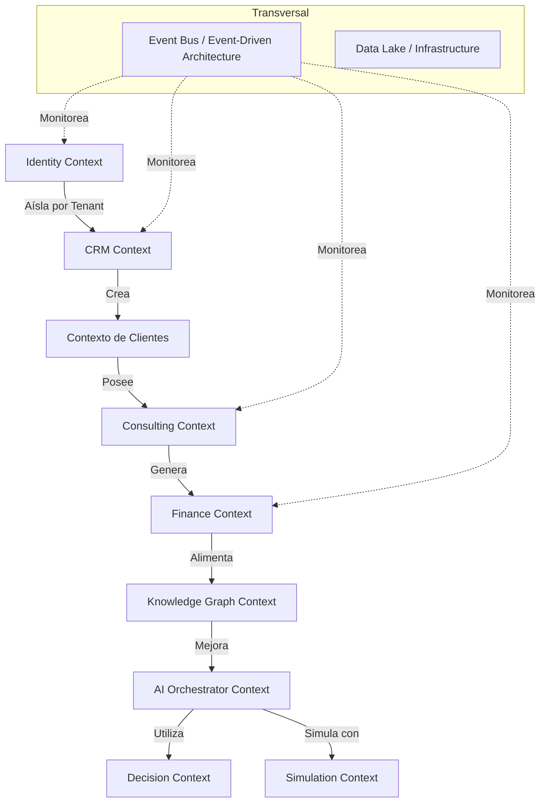

# Análisis Técnico y Arquitectónico Completo — Consulting Operating System (COS)

Este documento presenta un análisis estructurado y detallado del estado actual, arquitectura y hoja de ruta del **Consulting Operating System (COS)** (también conocido como **Command Center**). El objetivo de esta plataforma es digitalizar e integrar el conocimiento de consultoría de élite mediante un modelo de negocio de consultoría basado en activos (*Asset-Based Consulting*), desacoplando los ingresos de la plantilla y automatizando hasta un 95% de las tareas operativas de consultoría financiera, tributaria, legal y estratégica.

---

## 1. Visión Estratégica y Filosofía de Diseño

El sistema está concebido para ser el cerebro operativo de una firma de consultoría internacional de alto nivel (como la liderada por el Ec. Carlos Alberto Alman Vidal), orientada a resolver las ansiedades financieras de CEOs y CFOs en Latinoamérica (con enfoque inicial en Ecuador). 

No es simplemente un CRM, un ERP o un Dashboard de BI; es una solución unificada que integra:
* **CRM B2B**: Gestión del pipeline comercial corporativo de igualas mensuales (*retainers*) de alto valor.
* **ERP y Gestión de Proyectos**: Automatización y seguimiento metodológico (Kanban/Scrum) de cada proceso de consultoría.
* **Business Intelligence (BI) y Simulación**: Motor de predicción financiera (*nowcasting* macro, simulador de estrés y análisis de márgenes) para la toma de decisiones basada en datos empíricos, sirviendo como la principal herramienta de venta o demostración.
* **Motor Documental Avanzado (VDR)**: Almacenamiento seguro, indexación semántica y auditorías inmutables de estados financieros y contratos.
* **Capa de Razonamiento Agéntico**: Un ecosistema multiagente coordinado por un agente orquestador que ejecuta análisis especializados por dominios (financiero, tributario, comercial, etc.) con trazabilidad directa a la fuente primaria (*Iterative Source Decomposition* o **ISD**).

---

## 2. Estructura del Espacio de Trabajo

El espacio de trabajo se compone de tres carpetas principales con los siguientes propósitos:

1. **[command-center](file:///c:/Users/hp/OneDrive/Desktop/TESIS/tesis%20carlos/CONSULTORIA/command-center)**:
   * **Propósito**: Prototipo o aplicación independiente para el Dashboard Ejecutivo y simuladores interactivos.
   * **Tecnología**: Next.js 15 (SSR/App Router), Tailwind CSS y conexión directa a Supabase.
   * **Estado**: Sirve como demostración comercial. Cuenta con interfaces para la Sala de Guerra (Stress Simulator), Data Hub (carga de CSV) y chats básicos con agentes. Gran parte de sus datos y las respuestas de la IA se encuentran simulados en el frontend (hardcoded).
   * **Documento Relacionado**: [AUDITORIA_Y_MEJORAS.md](file:///c:/Users/hp/OneDrive/Desktop/TESIS/tesis%20carlos/CONSULTORIA/command-center/AUDITORIA_Y_MEJORAS.md).

2. **[cos](file:///c:/Users/hp/OneDrive/Desktop/TESIS/tesis%20carlos/CONSULTORIA/cos)**:
   * **Propósito**: El monorepo principal del Consulting Operating System. Contiene la arquitectura definitiva y la implementación de los servicios de grado empresarial.
   * **Tecnología**: Next.js 16 (frontend), NestJS (microservicios backend), PostgreSQL (base de datos con RLS), Prisma (ORM), Redis (caché/sesión), Keycloak (SSO) y contenedores Docker.
   * **Estructura del Monorepo**:
     * `apps/web`: Frontend Next.js 16 organizado por layouts para tres portales independientes (Portal del Cliente, Portal del Consultor, Portal del Director), con integración de Electron, Sentry y pruebas unitarias con Vitest.
     * `packages/prisma-schema`: Definición del esquema unificado de base de datos con más de 55 tablas normalizadas.
     * `packages/shared-types`: Definiciones de TypeScript compartidas entre el frontend y los microservicios.
     * `services/`: Carpeta de microservicios NestJS, que incluye:
       * `identity`: Totalmente implementado con controladores y servicios para empresas, usuarios y roles.
       * `clients`, `documents`, `finance`, `workflows`, `ai-orchestrator`, `bi`: Estructuras base (*scaffolds*) listas para el desarrollo de lógica de negocio.
     * `infra/`: Configuraciones de Docker, manifiestos de Kubernetes y plantillas vacías para Terraform.
   * **Documento Relacionado**: [AUDITORIA_COS.md](file:///c:/Users/hp/OneDrive/Desktop/TESIS/tesis%20carlos/CONSULTORIA/cos/AUDITORIA_COS.md).

3. **[services](file:///c:/Users/hp/OneDrive/Desktop/TESIS/tesis%20carlos/CONSULTORIA/services)**:
   * Contiene directorios `clients`, `documents` y `finance` que proveen lógica de base de datos (Prisma) y código fuente adicional que se integra con los microservicios del COS.

---

## 3. Dominios del Core Business (Bounded Contexts DDD)

Siguiendo el diseño de arquitectura dirigida por el dominio (DDD), la plataforma define claramente los límites de responsabilidad:

* **Identity Context**: Aislamiento estricto multi-tenant a través de Row Level Security (RLS) en PostgreSQL. Unifica Empresas, Sucursales, Usuarios, Roles y Permisos Granulares.
* **CRM Context**: Administra la captación comercial desde Leads calificados hasta Oportunidades en pipeline y Contratos de igualas mensuales (*retainers*).
* **Consulting Context**: Corazón de la entrega de valor. Controla Proyectos de diagnóstico o auditoría, Tareas (Kanban/Gantt), Hitos, Riesgos y la generación de Entregables.
* **Finance Context**: 
  * *Para el Cliente*: Balance General, Estado de Resultados, ratios, proyecciones y simulaciones financieras (reemplaza las tareas de un analista financiero).
  * *Para la Consultora (MSP)*: Gestión de rentabilidad interna, MRR, ARR, utilización de consultores, CAC y LTV.
* **AI Context (AI Orchestrator)**: Orquestación multiagente en base a flujos conversacionales (Router -> Planner -> Especialistas como Financiero/Tributario/Comercial/Documental -> Supervisor -> Validador de fuente -> Memoria).
* **Knowledge Context**: Gráfico de conocimiento conectado (Knowledge Graph) que asocia problemas del cliente con regulaciones (NIIF, leyes locales), estrategias ejecutadas y resultados de éxito/fracaso, facilitando el aprendizaje continuo de la organización.
* **Decision Context & Simulation**: Evaluación de riesgos en tiempo real mediante motores de reglas y simuladores de estrés basados en sliders interactivos (ej: impacto de la extensión de los días de cobro o cambios tributarios en el SRI).

---

## 4. Estado de Avance de la Implementación (Progreso General: ~35%)

El estado detallado por módulos funcionales del COS es el siguiente:

| Módulo | Alcance / Funcionalidad | Estado de Avance | Detalles Técnicos |
| :--- | :--- | :--- | :--- |
| **M1: Identidad** | Empresas, Usuarios, Roles, Organigrama, Permisos. | **90% - Implementado** | Schema Prisma + NestJS CRUD + Estructura de portal. |
| **M2: Clientes** | Datos fiscales, representantes, accionistas, reuniones, contratos. | **50% - Schema + Frontend** | Modelos Prisma definidos, vistas iniciales creadas. |
| **M3: Documental** | Almacenamiento, indexación de archivos, Data Hub de ingesta. | **50% - Schema + Frontend** | Drag & Drop UI con validaciones y mapeos de columnas. |
| **M4: Motor IA** | Agentes especializados, prompts, chat conversacional. | **20% - Esqueleto / UI** | Interfaz de chat diseñada con listado de fuentes; respuestas simuladas. |
| **M5: Workflows** | Orquestación de lógica de negocio y automatización de procesos. | **15% - Scaffold** | Modelos Prisma + servicio NestJS inicial. |
| **M6: BI Dashboard**| Gráficos de KPIs corporativos, Cash Flow, Forecast. | **30% - Frontend** | Panel con placeholders y variables estáticas en el frontend. |
| **M7: Proyectos** | Tablero Kanban, dependencias, hitos y riesgos. | **20% - Schema** | Modelos de base de datos listos en Prisma. |
| **M9: Financiero** | DCF Valuation, simulador de estrés y márgenes. | **25% - Frontend Parcial** | Interfaz del simulador con sliders y cálculos reactivos inmediatos en la vista. |
| **Portales UI** | Portal de Clientes, Portal de Consultores y Portal del Director. | **70-80% - Implementado** | Vistas y rutas Next.js 16 con layouts independientes y temas oscuros. |

---

## 5. Hallazgos de Auditoría y Brechas Críticas

Ambas auditorías internas ([cos/AUDITORIA_COS.md](file:///c:/Users/hp/OneDrive/Desktop/TESIS/tesis%20carlos/CONSULTORIA/cos/AUDITORIA_COS.md) y [command-center/AUDITORIA_Y_MEJORAS.md](file:///c:/Users/hp/OneDrive/Desktop/TESIS/tesis%20carlos/CONSULTORIA/command-center/AUDITORIA_Y_MEJORAS.md)) identifican los siguientes puntos críticos que requieren atención para consolidar un Producto Mínimo Viable (MVP):

### 5.1 Seguridad y Base de Datos (Severidad: CRÍTICA)
* **Políticas de Supabase/RLS Incompletas**: Falta programar las políticas de RLS para operaciones `UPDATE` y `DELETE` en tablas críticas (como `transactions`, `projections`, `documents`, `sessions`).
* **Validación de Carga de Datos**: La ingesta de archivos en el Data Hub solo valida la extensión del archivo (`.csv`, `.xlsx`), lo que abre vectores de riesgo. Debe implementarse validación server-side de tipo MIME y tamaño máximo de archivo.
* **Control de Errores Crudos**: Se exponen excepciones crudas provenientes de base de datos directamente al usuario en las pantallas de inicio de sesión y gestión documental.

### 5.2 Calidad del Código y Arquitectura (Severidad: ALTA)
* **Lógica Financiera Acoplada**: Fórmulas financieras (como la proyección en la Sala de Guerra) se ejecutan directamente en los renders del frontend Next.js en lugar de delegarse a bibliotecas específicas en backend o helper utilitarios optimizados (`useMemo`).
* **Sin Estado Global**: No hay una integración robusta de bibliotecas de gestión de estado global (como `Zustand`) o librerías de fetching de datos optimizadas (como `TanStack Query` / `React Query`), provocando recargas completas e innecesarias de la interfaz.
* **Ausencia de Tests**: Cobertura de pruebas del 0%. Se necesita configurar entornos de testing (Vitest, React Testing Library y MSW) para garantizar la inmutabilidad de la lógica de negocio.

### 5.3 Lógica Core Pendiente (Severidad: CRÍTICA)
* **Motores de Cálculo Reales**: El motor DCF, la simulación de Monte Carlo y el análisis de nowcasting macroeconómico (MIDAS) no están implementados en el backend. Actualmente están simulados mediante arreglos JSON fijos en la vista.
* **Capa Agéntica**: No existe un backend real con LangGraph y herramientas de base de datos asociadas a los agentes. El chat de la interfaz web responde textos fijos.
* **Indexación y RAG**: La integración del motor de búsqueda documental Elasticsearch y la base de datos vectorial Qdrant con trazabilidad ISD está en fase de diseño.

---

## 6. Plan de Acción Recomendado

Para estructurar la transición desde el estado actual (35% de avance) hacia un sistema productivo y comercializable, se propone el siguiente cronograma:

### Fase 1: Estabilización y Consolidación (Semanas 1-3)
1. **Seguridad**:
   * Escribir e implementar las directivas RLS de PostgreSQL para `UPDATE` y `DELETE` sobre el esquema multi-tenant.
   * Introducir validaciones de carga server-side (Zod schemas para validar payloads, verificación de tipos MIME).
2. **Robustez en Frontend**:
   * Instalar y configurar `@tanstack/react-query` y `zustand` para el manejo de estado global y caché de red.
   * Envolver llamadas asíncronas con manejadores `try/catch` y crear límites de errores (`error.tsx`, `global-error.tsx`).
   * Optimizar componentes con `React.memo`, `useCallback` y `useMemo` (especialmente en los simuladores interactivos).
3. **Migración a Datos Reales**:
   * Completar los CRUDs básicos en los scaffolds NestJS restantes (`clients` y `documents`).

### Fase 2: Desarrollo del Cerebro Analítico e IA (Semanas 4-8)
1. **Servicios de Simulación Financiera**:
   * Construir el backend en Python (FastAPI) para el motor DCF, Monte Carlo y optimización de capital utilizando librerías cuantitativas (`QuantLib`, `NumPy`, `SciPy`).
2. **Orquestador Multiagente**:
   * Desarrollar la arquitectura de agentes usando `LangGraph` y herramientas de conexión para el analista financiero, forense y de mercados.
3. **Capa RAG e ISD**:
   * Desplegar `Qdrant` para almacenar vectores de documentos con metadatos de trazabilidad granular (archivo, página, línea de procedencia) y configurar el flujo de ingesta y reranking.

### Fase 3: Integraciones y Automatización Avanzada (Semanas 9+)
1. **Tributario y Legal**:
   * Conexión con facturación del SRI (Ecuador), control tributario mensual y workflows de firma digital corporativa.
2. **Workflow Engine**:
   * Implementación de flujos condicionales de automatización (onboarding, alertas y diagnósticos automatizados).
3. **Monitoreo**:
   * Implementar `Sentry` para control de errores y configurar dashboards en `Grafana` / `Prometheus` para infraestructura cloud.

---

> [!NOTE]
> Este análisis sirve como diagnóstico detallado de la aplicación en su estado actual, listando componentes clave implementados, pendientes e inconsistencias que deben mitigarse antes de avanzar con lanzamientos o integraciones.
