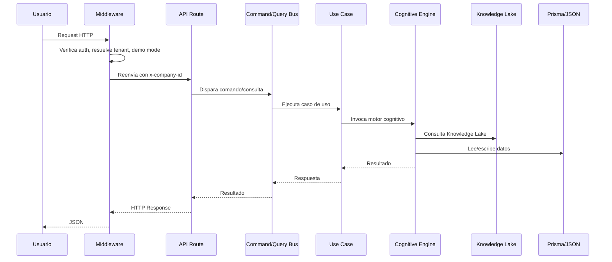
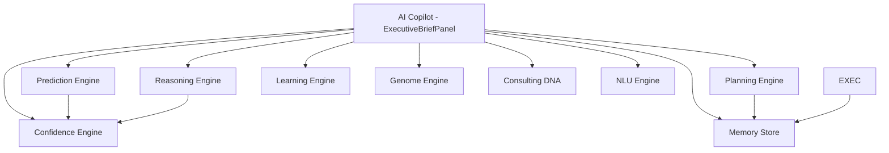

# MASTER BLUEPRINT — BI OS PLATFORM

## DOCUMENTO MAESTRO DEFINITIVO DE LA PLATAFORMA

**Versión:** 1.0  
**Clasificación:** CONFIDENCIAL — Solo para equipo de desarrollo  
**Single Source of Truth:** Sí  
**Fecha:** Julio 2026  
**Auditoría:** Completa — 233+ capacidades mapeadas

---

## PARTE 1: VISIÓN GENERAL Y ARQUITECTURA GLOBAL

---

### 1. VISIÓN GENERAL

#### 1.1 Historia del Proyecto

BI OS Platform (originalmente "Infinity Command Center" / "Consulting Operating System") nace como una plataforma integral de inteligencia empresarial para el mercado ecuatoriano y latinoamericano. El proyecto comenzó como un sistema de automatización para una consultora estratégica, evolucionando hacia un producto SaaS completo que integra:

- **Análisis financiero automatizado** con ratios, tendencias y proyecciones
- **Benchmarking inteligente** contra datos sectoriales (Supercias, SRI)
- **Planificación estratégica** con generación automática de planes
- **Monitoreo de ejecución** con detección de desviaciones
- **Business Case Library** con aprendizaje de casos anteriores
- **Executive AI Copilot** con razonamiento contextual
- **Enterprise Genome** para diagnóstico organizacional
- **Knowledge Lake** con IFRS, KPIs, benchmarks, ontologías
- **Consulting DNA** con reglas de negocio y umbrales
- **Product OS** para gestión del portafolio de servicios
- **Stripe billing** para monetización SaaS
- **NLU** para clasificación semántica de consultas
- **XBRL Parser** para lectura de estados financieros XML
- **Web Scraping** para benchmarks desde fuentes oficiales
- **Notificaciones** para alertas inteligentes
- **Exportación** PDF/CSV/Excel de reportes

#### 1.2 Objetivo

Democratizar el acceso a inteligencia empresarial de clase mundial para PYMES y consultoras en Latinoamérica, automatizando el 95% del trabajo operativo de análisis financiero, planificación estratégica y monitoreo de ejecución.

#### 1.3 Problemas que Resuelve

| Problema | Solución BI OS |
|---|---|
| Consultoras pasan 70% del tiempo en hojas de cálculo | Automatización de análisis financiero completo |
| PYMES no tienen acceso a benchmarks sectoriales | Web scraping + datos Supercias/SRI integrados |
| Falta de estandarización en diagnósticos | Consulting DNA con 400+ conceptos IFRS y 100+ KPIs |
| El conocimiento se pierde cuando los consultores se van | Business Case Library con aprendizaje continuo |
| Planes estratégicos no se ejecutan | Planning + Execution engines con detección de desviaciones |
| Sin visibilidad del estado real de la consultora | Director Dashboard + Telemetría + Genome |
| Procesos manuales y repetitivos | Executive AI Copilot + NLU + automatización |
| Precios y empaquetamiento inconsistentes | Product OS con catálogo, certificación y billing |

#### 1.4 Clientes Objetivo

- **Consultoras financieras/estratégicas** (target primario): 5-50 consultores
- **PYMES** (target secundario): $1M-$20M facturación anual
- **Departamentos financieros corporativos**: Empresas con 50-500 empleados
- **Firmas de auditoría**: 4-40 socios
- **Incubadoras/aceleradoras**: Gestión de portafolio

#### 1.5 Ventajas Competitivas

1. **Integración vertical completa**: No es un CRM, ERP, BI o Dashboard — es un sistema operativo que integra todo en una plataforma unificada
2. **Conocimiento de dominio ecuatoriano**: Supercias, SRI, IFRS, CIIU, benchmarks locales
3. **Executive AI nativo**: Copiloto contextualizado con 8 motores cognitivos
4. **Enterprise Genome**: Diagnóstico organizacional en 14 dimensiones propietarias
5. **Auto-aprendizaje**: Business Case Library que mejora con cada caso
6. **Product OS interno**: La propia plataforma se gestiona a sí misma como un producto
7. **Persistencia zero-config**: JSON file-based, sin PostgreSQL, portable vía Electron
8. **NLU en español**: 12 intenciones, 7 tipos de entidades, clasificación semántica local

#### 1.6 Casos de Uso Principales

| Caso de Uso | Actor | Descripción |
|---|---|---|
| Diagnóstico financiero automático | Consultor | Sube estados financieros → recibe ratios, tendencias, alertas, recomendaciones |
| Benchmark competitivo | Director | Compara KPIs del cliente contra industria (Supercias) |
| Planificación estratégica | Consultor + Cliente | Define objetivos → sistema genera plan con fases, KPIs, presupuesto |
| Monitoreo de ejecución | Consultor | Sistema detecta desviaciones → propone correcciones |
| Business Case reuse | Consultor | Busca casos similares → aplica lecciones aprendidas |
| Executive Brief diario | Director | Resumen ejecutivo con alertas, predicciones, recomendaciones |
| Portal Cliente | Cliente | Documentos, reportes, mensajes, reuniones en un solo lugar |
| Product OS | Director | Gestiona productos, versiones, licencias, certificaciones |
| Onboarding de clientes | Consultor | Registro → carga documentos → análisis inicial → plan |
| Análisis XBRL | Consultor | Sube XML → parsea 30+ conceptos IFRS → calcula 12 ratios |

#### 1.7 Valor Diferencial

- **No requiere instalación de base de datos** — persistencia JSON embebida
- **Funciona offline** — los motores cognitivos no requieren conexión a internet
- **Portable via Electron** — ejecutable .exe, doble clic y funciona
- **Demo instantánea** — POST /api/beta siembra datos demo completos
- **Arquitectura migrable** — DDD + CQRS preparados para escalar a microservicios
- **Multi-tenancy nativa** — middleware resuelve companyId por cookie/header/sesión

---

### 2. ARQUITECTURA GENERAL

#### 2.1 Diagrama de Arquitectura General

```mermaid
graph TB
    subgraph "CLIENTES"
        WEB[Next.js 16 SSR]
        ELECTRON[Electron Portable]
    end

    subgraph "MIDDLEWARE"
        MW[Middleware: Auth + Multi-Tenant + Demo Mode]
    end

    subgraph "API LAYER 63 Endpoints"
        API_REST[REST API Routes]
    end

    subgraph "CORE DOMAIN - DDD + CQRS"
        BUS[CommandBus + QueryBus + EventBus]
        UC[Use Cases]
        Q[Queries]
        SVC[Domain Services]
        FAC[Facades]
        
        subgraph "COGNITIVE ENGINES"
            PRED[Prediction Engine]
            REAS[Reasoning Engine]
            PLAN[Planning Engine]
            EXEC[Execution Engine]
            MEM[Memory Store]
            LEARN[Learning Engine]
            OPT[Optimization Engine]
            GENO[Genome Engine]
            NLU_ENG[NLU Engine]
            CONF[Confidence Engine]
            SCRAPE[Scraping Service]
            NOTIF[Notification Service]
            XBRL_ENG[XBRL Parser]
            ENH_PRED[Enhanced ML Prediction]
        end

        subgraph "KNOWLEDGE LAKE"
            IFRS[IFRS Taxonomy - 400+ concepts]
            KPI[KPI Library - 100+ KPIs]
            BENCH[Benchmarks - 9 industries]
            SRI[SRI Tax Intelligence]
            ONTO[Enterprise Ontology]
            DNA[Consulting DNA]
            GRAPH[Knowledge Graph]
        end

        subgraph "INFRASTRUCTURE"
            REPO[Repositories - Prisma]
            UOW[Unit of Work]
            POL[Policies]
            SPEC[Specifications]
            VAL[Validation]
            EVT[Domain Events]
            OUTBOX[Outbox Pattern]
            PERSIST[Persistence Manager]
        end
    end

    subgraph "EXTERNAL"
        SUPABASE[Supabase Auth]
        STRIPE[Stripe Payments]
        PRISMA_DB[Prisma/PostgreSQL]
        ORCH[Orchestrator API]
        SRI_SITE[SRI Website]
        SUPERCIAS_SITE[Supercias Website]
    end

    WEB --> MW
    ELECTRON --> MW
    MW --> API_REST
    API_REST --> BUS
    API_REST --> UC
    API_REST --> ENGINES
    BUS --> UC
    UC --> SVC
    UC --> FAC
    SVC --> REPO
    SVC --> EVT
    REPO --> PRISMA_DB
    REPO --> PERSIST
    PERSIST --> JSON[(JSON Files)]
    ENGINES --> MEM
    ENGINES --> KNOWLEDGE_LAKE
    ENGINES --> DNA
    ENGINES --> CONF
    API_REST --> SUPABASE
    API_REST --> STRIPE
    API_REST --> ORCH
    SCRAPE --> SRI_SITE
    SCRAPE --> SUPERCIAS_SITE
```



#### 2.2 Capas Arquitectónicas

| Capa | Tecnología | Propósito |
|---|---|---|
| **Presentación** | Next.js 16 + React 19 + Tailwind CSS 4 | SSR, CSR, SPA |
| **Infraestructura Web** | Next.js App Router + Turbopack | Enrutamiento, compilación |
| **Middleware** | Next.js Middleware + Supabase SSR | Auth, multi-tenancy, demo mode |
| **API** | Next.js API Routes (63 endpoints) | REST endpoints |
| **Aplicación** | Casos de Uso + Queries + Domain Services | Orquestación de lógica de negocio |
| **Dominio** | Cognitive Engines + Knowledge Lake | Inteligencia de negocio |
| **Infraestructura Datos** | Prisma + JSON Persistence + Cache | Almacenamiento |
| **Externo** | Supabase + Stripe + Orchestrator | Servicios externos |

#### 2.3 Patrón DDD (Domain-Driven Design)

```
src/core/
├── bus/           → CommandBus, QueryBus, EventBus (CQRS)
├── use-cases/     → Casos de uso DDD (identity, crm, consulting, workflow)
├── queries/       → Consultas CQRS (DashboardDirectorQuery, ClientHealthQuery)
├── domain/        → Servicios, repositorios, eventos
│   ├── services/  → FinancialAnalysis, ClientHealth, RiskAssessment, etc.
│   ├── repositories/ → Interfaces + Prisma implementaciones
│   ├── events/    → Domain Events
│   ├── policies/  → Authorization policies
│   ├── specifications/ → Specification pattern
│   ├── validation/ → Business rules
│   ├── unit-of-work/ → Transaccionalidad
│   └── outbox/    → Outbox pattern
├── facades/       → Facade pattern (IdentityFacade, CrmFacade, ConsultingFacade)
├── errors/        → DomainError + subtipos
├── result/        → Result<T> monad
└── persistence/   → Auto-save/load JSON
```

#### 2.4 Flujo de Datos General



#### 2.5 Dependencias del Proyecto

```
package.json dependencies (producción):
├── @react-pdf/renderer ^4.5.1    → PDF generation
├── @supabase/ssr ^0.6.0          → Server-side Supabase auth
├── @supabase/supabase-js ^2.49.4 → Supabase client
├── @tanstack/react-query ^5.62.0 → Data fetching
├── date-fns ^4.1.0               → Date utilities
├── lucide-react ^0.487.0         → Icons
├── next 16.2.9                   → Framework
├── react 19.2.4 + react-dom      → UI library
├── recharts ^2.15.0              → Charts
├── stripe ^22.3.0                → Payments
├── zod ^3.24.0                   → Validation
└── zustand ^5.0.0               → State management

devDependencies:
├── @tailwindcss/postcss ^4       → Tailwind PostCSS
├── @types/node, @types/react     → TypeScript types
├── concurrently ^9.1.0           → Run scripts in parallel
├── electron ^33.4.11             → Desktop runtime
├── electron-builder ^25.1.8      → Package desktop app
├── eslint ^9 + eslint-config-next → Linting
├── tailwindcss ^4               → CSS framework
├── typescript ^5                 → Language
└── wait-on ^8.0.1               → Wait for server
```

No external dependencies for:
- **Excel generation**: XML Spreadsheet nativo (sin xlsx)
- **XBRL parsing**: Regex + XML nativo (sin librería XML)
- **NLU**: Pattern matching puro TypeScript
- **Enhanced ML**: Algoritmos estadísticos TypeScript puros
- **Scraping**: Node.js native fetch
- **Notifications**: In-memory con interfaz de transporte

---

### 3. ARQUITECTURA TÉCNICA

#### 3.1 Frontend

| Aspecto | Implementación |
|---|---|
| **Framework** | Next.js 16 con App Router |
| **Compilador** | Turbopack (built-in de Next 16) |
| **Lenguaje** | TypeScript 5.x strict |
| **UI** | Tailwind CSS 4 con tema oscuro premium |
| **Fuentes** | Inter (sans) + JetBrains Mono (code) |
| **Iconos** | Lucide React |
| **Gráficos** | Recharts |
| **Estado global** | Zustand (user, sidebar, theme) |
| **Data fetching** | React Query (@tanstack/react-query) |
| **Validación** | Zod schemas |
| **Componentes** | Funcionales con hooks, sin class components |
| **Server Components** | Layouts y páginas sin "use client" |
| **Client Components** | Componentes interactivos con "use client" |

**Tema:** Tono oscuro premium con paleta surface (slate-inspired) y accent (azul):
```css
--color-surface-50: #f8fafc  ...  --color-surface-950: #020617
--color-accent-50: #eff6ff  ...  --color-accent-950: #172554
--color-success: #10b981, --color-warning: #f59e0b, --color-danger: #ef4444
```

**Layouts:**
- **Root**: Fuentes, Providers (React Query), Core init
- **Consultor**: Sidebar + Header + main content
- **Director**: Header con navegación + BetaWelcome
- **Cliente**: Header simplificado + main

#### 3.2 Backend (API Layer)

63 endpoints REST organizados en subdirectorios por dominio:

```typescript
// Patrón de API route típico
export async function GET(req: NextRequest) {
  const session = await getSessionFromRequest(req).catch(() => null)
  // Si demo mode, usar x-company-id header
  const companyId = session?.companyId || req.headers.get("x-company-id") || "demo-company"
  // ...
  return NextResponse.json(result)
}
```

**Manejo de errores:**
- Errores de validación → 400
- No autorizado → 401
| No encontrado → 404
| Error interno → 500 con mensaje

#### 3.3 Cognitive Engines (11 motores)

| Motor | Archivo | Propósito |
|---|---|---|
| **PredictionEngine** | `core/prediction/engine.ts` | Proyecciones lineales, escenarios, alertas tempranas |
| **EnhancedPredictionEngine** | `core/prediction/enhanced.ts` | ARIMA-like, Seasonal ARIMA, Holt-Winters, anomalías |
| **ReasoningEngine** | `core/reasoning/engine.ts` | Diagnóstico financiero, hipótesis, recomendaciones |
| **PlanningEngine** | `core/planning/engine.ts` | Generación de planes estratégicos multi-fase |
| **ExecutionEngine** | `core/execution/engine.ts` | Monitoreo, desviaciones, correcciones, snapshots |
| **MemoryStore** | `core/memory/store.ts` | Almacenamiento de memoria empresarial |
| **LearningEngine** | `core/learning/engine.ts` | Business Case Library, casos similares, estadísticas |
| **OptimizationEngine** | `core/optimization/engine.ts` | Optimización de cartera y precios |
| **GenomeEngine** | `core/genome/engine.ts` | Diagnóstico organizacional en 14 dimensiones |
| **ConfidenceEngine** | `core/confidence/index.ts` | Scoring de confianza para predicciones/diagnósticos |
| **NLUEngine** | `core/nlu/index.ts` | Clasificación semántica de texto en español |

#### 3.4 Servicios de Dominio (6 servicios)

| Servicio | Archivo | Propósito |
|---|---|---|
| **FinancialAnalysisService** | `core/services/FinancialAnalysisService.ts` | Análisis de estados financieros |
| **ClientHealthService** | `core/services/ClientHealthService.ts` | Score de salud del cliente |
| **RiskAssessmentService** | `core/services/RiskAssessmentService.ts` | Evaluación de riesgos |
| **TaxCalculationService** | `core/services/TaxCalculationService.ts` | Cálculos tributarios |
| **ComplianceService** | `core/services/ComplianceService.ts` | Validación de cumplimiento |
| **StrategicPlanningService** | `core/services/StrategicPlanningService.ts` | Planeación estratégica |

#### 3.5 Repositorios

```
core/repositories/
├── index.ts                    → Export types
├── prisma/
│   ├── CompanyRepository.ts    → CRUD compañías
│   ├── UserRepository.ts       → CRUD usuarios
│   ├── ClientRepository.ts     → CRUD clientes
│   ├── LeadRepository.ts       → CRUD leads
│   ├── DocumentRepository.ts   → CRUD documentos
│   └── FinancialStatementRepository.ts → CRUD estados financieros
```

Cada repositorio implementa una interfaz con métodos estándar (findById, findAll, create, update, delete) usando Prisma.

#### 3.6 Patrón CQRS (Command Query Responsibility Segregation)

```
core/bus/
├── index.ts                    → CommandBus, QueryBus, EventBus
├── CommandBus.ts               → Registra handlers, ejecuta comandos
├── QueryBus.ts                 → Registra handlers, ejecuta consultas
└── EventBus.ts                 → Publica eventos, notifica handlers
```

**Use Cases registrados:**
```
use-cases/
├── identity/
│   ├── RegisterCompanyUseCase
│   ├── LoginUseCase
│   └── InviteUserUseCase
├── crm/
│   ├── CreateClientUseCase
│   ├── OnboardClientUseCase
│   └── ConvertLeadUseCase
├── consulting/
│   ├── AnalyzeStatementsUseCase
│   ├── GenerateReportUseCase
│   └── StrategicPlanUseCase
└── workflow/
    ├── ExecuteWorkflowUseCase
    └── CompleteWorkflowUseCase
```

#### 3.7 DDD Building Blocks

| Bloque | Implementación | Propósito |
|---|---|---|
| **Aggregate** | No explícito | Entidades con límites transaccionales |
| **Value Object** | Tipos inmutables | Conceptos sin identidad (ratios, scores) |
| **Domain Event** | `events/*` | Eventos de negocio (ClientCreated, CompanyRegistered) |
| **Repository** | `repositories/*` | Abstracción de persistencia |
| **Unit of Work** | `unit-of-work/index.ts` | Transaccionalidad |
| **Domain Service** | `services/*` | Lógica sin estado |
| **Specification** | `specifications/*` | Filtros reutilizables |
| **Policy** | `policies/*` | Reglas de autorización |
| **Factory** | Constructores | Creación de objetos complejos |
| **Module** | Directorios | Agrupación por dominio |

#### 3.8 Antipatrones Detectados

1. **Tight coupling entre engines**: Prediction → Memory → Confidence → DNA (cadena rígida)
2. **In-memory state en producción**: Los engines pierden estado al reiniciar (persistencia JSON parcial)
3. **Mock data en lugar de Prisma**: Varios endpoints retornan datos mock en lugar de consultar DB
4. **Sin tests**: No hay tests unitarios, de integración ni e2e
5. **Orquestador externo**: `/api/analyze`, `/api/chat`, `/api/monte-carlo` son proxies a un orquestador que puede no existir
6. **Sin rate limiting**: No hay protección contra abuso de API
7. **Tokens hardcodeados**: `TOKEN_SECRET` usa fallback "a".repeat(32) en lugar de variable de entorno real
8. **Sin logging estructurado**: console.log en lugar de logger
9. **Sin validación de input en varios endpoints**: Falta schemas Zod en múltiples rutas
10. **Middlewares duplicados**: `middleware.ts` y `utils/supabase/middleware.ts` tienen responsabilidades solapadas

---

### 4. ARQUITECTURA DE IA

#### 4.1 Executive AI

El Executive AI es el cerebro de la plataforma, implementado como un copiloto contextualizado que integra 8 motores cognitivos:



**Flujo del Executive Brief:**
1. Sistema recopila contexto: memoria reciente, alertas activas, predicciones, diagnósticos
2. Confidence Engine evalúa la confianza de cada componente
3. ExecutiveBriefPanel renderiza: saludo, alertas críticas, predicciones, razonamiento, métricas
4. Usuario puede preguntar vía NLU, que clasifica la intención y responde

#### 4.2 AI Copilot (Chat)

Implementado en `CopilotPanel.tsx`:
- Flotante en esquina inferior derecha
- Historial de conversación
- Queries sugeridas
- Ejecución de herramientas
- Feedback thumbs up/down
- Proxy a orquestador externo con fallback offline

Ruta: `POST /api/ai/copilot` → Orquestador externo + memoria
Ruta: `POST /api/ai/copilot/feedback` → Registra feedback
Ruta: `GET /api/ai/copilot/stats` → Estadísticas de trazas AI

#### 4.3 Knowledge Lake

Estructura completa:

```
core/knowledge/
├── index.ts           → KnowledgeService (consulta centralizada)
├── ifrs/
│   ├── taxonomy.ts    → 400+ conceptos IFRS (activos, pasivos, patrimonio, ingresos, gastos)
│   ├── validator.ts   → Validación de cobertura IFRS (mínimos requeridos por tipo de empresa)
│   └── engine.ts      → Cálculo de ratios IFRS
├── kpis/
│   └── index.ts       → 100+ KPIs en 30+ dominios con fórmulas, unidades, benchmarks
├── benchmarks/
│   └── index.ts       → Benchmarks por industria (9 industrias, 14 métricas, percentiles p25/p50/p75)
├── sri/
│   └── index.ts       → Tasas SRI, tabla de ingresos, categorías CIIU, retenciones
├── graph/
│   └── index.ts       → Ontología empresarial (clases, relaciones, propiedades)
└── regulatory/
    └── ...            → (vacío - pendiente)
```

**IFRS Taxonomy** (400+ conceptos):
- Activos corrientes: 23 conceptos (efectivo, cuentas por cobrar, inventarios, etc.)
- Activos no corrientes: 18 conceptos (PPE, intangibles, goodwill, etc.)
- Pasivos: 20+ conceptos (cuentas por pagar, deuda corto/largo plazo, etc.)
- Patrimonio: 10+ conceptos (capital, reservas, resultados, etc.)
- Ingresos: 15+ conceptos
- Gastos: 30+ conceptos
- Cuentas analíticas: 300+ conceptos detallados

**KPI Library** (100+ KPIs en 30+ dominios):
- Liquidez: 5 KPIs (current ratio, quick ratio, cash ratio, etc.)
- Solvencia: 6 KPIs (debt-to-equity, debt-to-assets, interest coverage, etc.)
- Rentabilidad: 8 KPIs (ROE, ROA, net margin, gross margin, operating margin, etc.)
- Eficiencia: 7 KPIs (asset turnover, inventory turnover, AR turnover, etc.)
- Crecimiento: 5 KPIs
- Valoración: 6 KPIs
- Por industria: retail, manufactura, servicios, construcción, tecnología, etc.

**Benchmarks** (9 industrias × 14 métricas × 3 percentiles):
Industrias: Manufactura, Comercio, Servicios, Construcción, Tecnología, Agricultura, Transporte, Minero, Financiero
Métricas: currentRatio, quickRatio, debtToEquity, debtToAssets, netMargin, grossMargin, operatingMargin, ROE, ROA, assetTurnover, inventoryTurnover, ARTurnover, cashRatio, interestCoverage

**SRI Tax Intelligence:**
- Tasas de impuesto a la renta (9 tramos: 0% a 35%)
- IVA (15% y 0%)
- Patente municipal (0.5% sobre activos)
- Categorías CIIU completas
- Retenciones en la fuente

**Enterprise Ontology:**
- Clases: Empresa, Persona, CuentaFinanciera, Contrato, Producto, Servicio, Documento, Proyecto, Workflow, Indicador, Riesgo, Alerta, Plan
- Relaciones: emplea, provee, contrata, invierte, reporta, audita, asesora, regula, supervisa, certifica
- Propiedades: nombre, tipo, estado, fecha, valor, porcentaje, categoría, prioridad, criticidad

#### 4.4 Consulting DNA

Implementado en `core/consulting-dna/index.ts`:

**Estructura:**
```
ConsultingDNA
├── categories: 7 categorías de diagnóstico
├── rules: 20+ reglas de evaluación (ratios × umbrales)
├── thresholds: 25+ umbrales con warning/critical por indicador
├── patterns: 30+ patrones de diagnóstico (condiciones + conclusiones)
├── maturityScales: 10+ escalas de madurez (niveles 1-5)
├── recommendations: 25+ recomendaciones por hallazgo
└── taxonomy: 100+ términos clasificados
```

**Categorías:**
1. liquidity → Liquidez y Capital de Trabajo
2. solvency → Solvencia y Estructura de Capital
3. profitability → Rentabilidad y Margen
4. efficiency → Eficiencia Operativa
5. growth → Crecimiento y Expansión
6. governance → Gobierno Corporativo
7. compliance → Cumplimiento Regulatorio

**Reglas de evaluación (ejemplos):**
- Si currentRatio < 1.0 → "Liquidez crítica"
- Si debtToEquity > 3.0 → "Sobreendeudamiento"
- Si ROE < 5% → "Rentabilidad insuficiente"
- Si netMargin < inflación → "Márgenes erosionados"

**Umbrales por indicador:**
```
currentRatio:     warning=1.2, critical=1.0
quickRatio:       warning=0.8, critical=0.5
debtToEquity:     warning=1.5, critical=2.5
netMargin:        warning=0.05, critical=0.02
ROE:              warning=0.08, critical=0.03
operatingMargin:  warning=0.08, critical=0.04
```

**Escalas de Madurez:**
- Gestión Financiera (5 niveles)
- Planeación Estratégica
- Gestión de Riesgos
- Cumplimiento
- Transformación Digital
- Gestión de Talento
- Innovación
- Sostenibilidad

**Fortalezas:** Cobertura completa de diagnóstico financiero, reglas configurables, integración con Confidence Engine
**Debilidades:** Reglas estáticas (no ML), no aprenden de nuevos casos automáticamente

#### 4.5 Enterprise Genome

Implementado en `core/genome/engine.ts` — Diagnóstico organizacional en 14 dimensiones:

1. **financial_health** → Salud financiera
2. **market_position** → Posición de mercado
3. **operational_efficiency** → Eficiencia operativa
4. **innovation** → Innovación
5. **talent** → Talento humano
6. **governance** → Gobierno corporativo
7. **technology** → Tecnología
8. **compliance** → Cumplimiento
9. **sustainability** → Sostenibilidad
10. **customer_satisfaction** → Satisfacción del cliente
11. **supply_chain** → Cadena de suministro
12. **risk_management** → Gestión de riesgos
13. **digital_maturity** → Madurez digital
14. **strategic_alignment** → Alineación estratégica

**Cálculo:**
- Cada dimensión: score 0-100 basado en reglas + datos
- Confianza por dimensión (0-1)
- Score global: promedio ponderado por relevancia (configurable por industria)
- Fortalezas: dimensiones con score > 70
- Debilidades: dimensiones con score < 40
- Recomendaciones: acciones sugeridas por dimensión baja

**API:** `POST /api/genome` → `genomeEngine.analyze(companyId, name, industry, size)`

#### 4.6 Prediction Engine

**Modelo actual (`PredictionEngine`):**
- Regresión lineal simple (mínimos cuadrados)
- Proyección a 30 y 90 días
- Bounds superior/inferior con 95% de confianza
- 4 escenarios: base (60%), optimista (20%), pesimista (15%), estrés (5%)
- Alertas tempranas: cruce de umbrales de DNA

**Modelo mejorado (`EnhancedPredictionEngine`):**
- ARIMA-like: diferenciación + media móvil
- Seasonal ARIMA: detección y descomposición estacional
- Holt-Winters: suavizado exponencial con trend
- Descomposición estacional: trend + seasonal + residual
- Detección de anomalías: basada en desviación estándar
- Alertas multi-umbral: warning + critical

#### 4.7 Limitaciones de IA

1. **Sin LLM real**: NLU es pattern-matching, no embeddings/semántica real
2. **Sin RAG**: No hay retrieval-augmented generation
3. **Sin vectores**: Embeddings no implementados
4. **Sin fine-tuning**: Modelos no entrenados específicamente
5. **Sin agentes autónomos**: Los "agentes" son interfaces, no agentes autónomos
6. **Sin aprendizaje online**: La biblioteca de casos no entrena modelos automáticamente
7. **Scraping simulado**: No hace HTTP real a SRI/Supercias (usa datos embebidos)
8. **Confianza subjetiva**: Confidence Engine usa heurísticas, no calibración estadística

#### 4.8 Potencial de IA

1. **RAG con Knowledge Lake**: Usar los 400+ conceptos IFRS + 100+ KPIs + benchmarks como base para RAG
2. **Fine-tuning**: Entrenar modelo pequeño (Llama 3/Phi-3) en casos de consultoría
3. **Agentes LangGraph**: Agente planificador → ejecutor → validador con herramientas
4. **Embeddings**: Vectorizar biblioteca de casos para búsqueda semántica real
5. **ML automático**: Prophet para forecasting, clasificador para diagnóstico
6. **Anomaly detection ML**: Isolation Forest para detección de anomalías financieras
7. **Graph RAG**: Usar la ontología empresarial para RAG sobre Knowledge Graph
