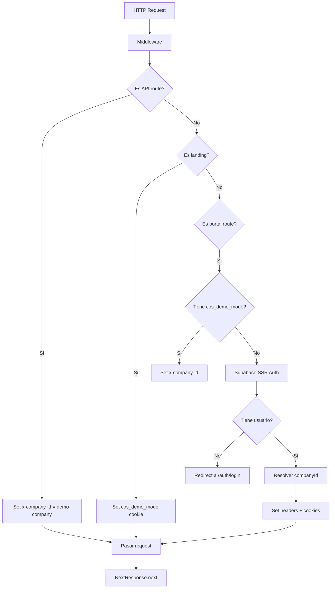
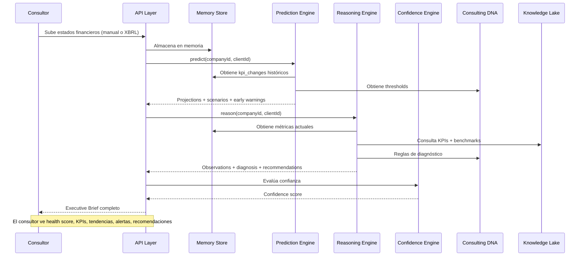
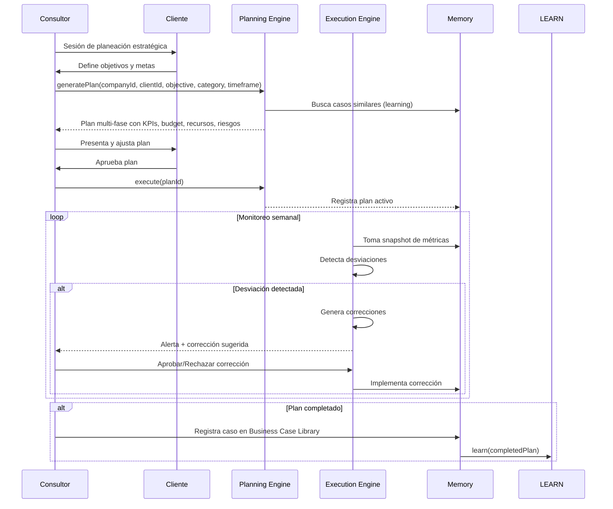
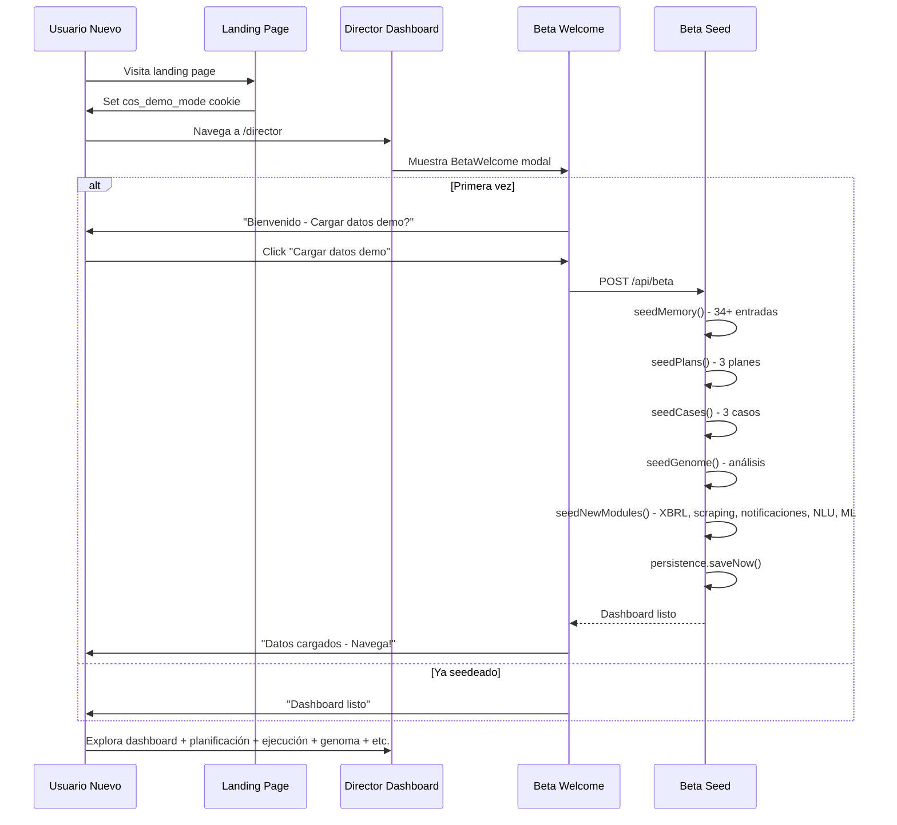
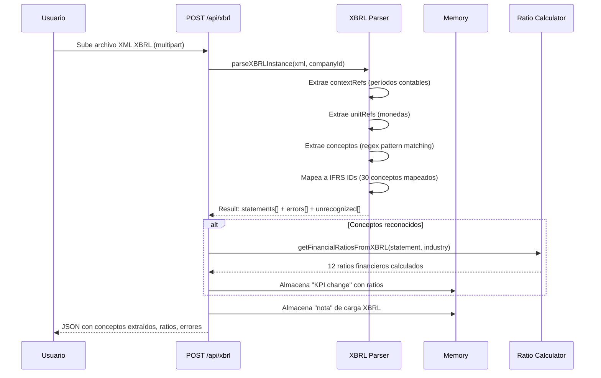
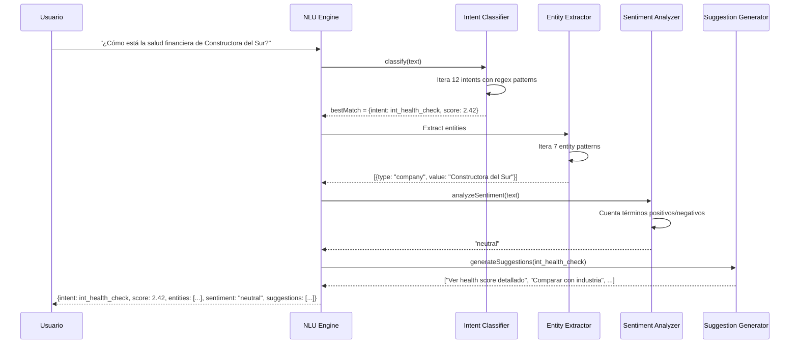

# MASTER BLUEPRINT — PARTE 3: SEGURIDAD, FLUJOS, CAPACIDADES Y ROADMAP

---

### 8. SISTEMA DE SEGURIDAD

#### 8.1 Autenticación

| Capa | Mecanismo | Estado |
|---|---|---|
| **Supabase Auth** | `@supabase/ssr` con cookies | Implementado |
| **Demo Mode** | Cookie `cos_demo_mode=true` + header `x-company-id: demo-company` | Implementado |
| **Session Token** | AES-256-GCM encrypt/decrypt | Implementado |
| **Session Cookie** | `cos_session` → `getSessionFromRequest()` | Implementado |
| **Company ID Cookie** | `cos_company_id` | Implementado |

#### 8.2 Middleware Security Flow



#### 8.3 Roles y Permisos

```typescript
// Políticas de autorización
- SubscriptionActivePolicy → Verifica suscripción activa
- HasPermissionPolicy → Verifica permiso específico
- UserIsActivePolicy → Verifica usuario activo
- CanDeleteClientPolicy → Solo admin/senior
- CanApproveInvoicePolicy → Solo director
- CanRunAuditPolicy → Solo socio
- CanCreateStrategyPolicy → Senior+
```

**Roles implementados:** (en memoria, via API identity/roles)
- admin → Acceso total
- director → Dashboard + estratégico
- consultor → Operaciones + clientes
- cliente → Portal limitado

#### 8.4 Multi-Tenancy

```typescript
// Resolución de tenant (orden de precedencia):
1. user_metadata.companyId (Supabase auth)
2. Cookie cos_company_id
3. Header x-company-id (middleware)
4. Fallback: "demo-company"

// Scopes de Prisma:
tenantFindMany(model, companyId) → Filtra automáticamente por companyId
tenantCreate(model, data, companyId) → Asigna companyId automáticamente
```

#### 8.5 Riesgos de Seguridad Detectados

| Riesgo | Criticidad | Descripción |
|---|---|---|
| **Token Secret hardcodeado** | ALTA | `TOKEN_SECRET` usa "a".repeat(32) como fallback |
| **Demo mode sin restricciones** | MEDIA | Cualquiera puede acceder a datos demo |
| **Sin rate limiting** | MEDIA | APIs expuestas sin límite de requests |
| **Sin validación CSRF** | MEDIA | No hay tokens CSRF en formularios |
| **Cookies sin Secure flag** | BAJA | En producción deberían ser Secure + HttpOnly |
| **Supabase keys expuestas** | MEDIA | Las keys están en variables de entorno, expuestas en client |
| **Sin HTTPS local** | BAJA | Dev corre en HTTP |
| **Maestros compartidos** | BAJA | demo-company es el mismo para todos los usuarios demo |

---

### 9. FLUJOS DE NEGOCIO

#### 9.1 Flujo de Diagnóstico Financiero Completo



#### 9.2 Flujo de Planificación Estratégica



#### 9.3 Flujo de Executive Brief Diario

```mermaid
sequenceDiagram
    participant D as Director
    participant EXEC as Executive Brief API
    participant MEM as Memory
    participant PRED as Prediction
    participant REAS as Reasoning
    participant GENO as Genome
    participant LEARN as Learning
    
    D->>EXEC: GET /api/executive
    EXEC->>MEM: getRecent(companyId, 20)
    EXEC->>MEM: summarize(companyId)
    EXEC->>PRED: predict(companyId)
    EXEC->>REAS: reason(companyId)
    EXEC->>GENO: getGenome(companyId)
    EXEC->>LEARN: getStats()
    
    PARALLEL
        PRED-->>EXEC: Alertas críticas + predicciones
        REAS-->>EXEC: Observaciones + diagnósticos
        GENO-->>EXEC: Score global + fortalezas/debilidades
        MEM-->>EXEC: Resumen de actividad reciente
        LEARN-->>EXEC: Estadísticas de casos
    END
    
    EXEC-->>D: Brief completo: alertas, métricas, predicciones, recomendaciones
```

#### 9.4 Flujo Beta / Demo



#### 9.5 Flujo XBRL



#### 9.6 Flujo NLU + Respuesta



---

### 10. CASOS DE USO

| ID | Actor | Objetivo | Flujo | Resultado |
|---|---|---|---|---|
| UC-01 | Consultor | Diagnosticar cliente | Sube estados → sistema analiza → ratios + tendencias + alertas | Diagnóstico completo |
| UC-02 | Consultor | Cargar XBRL | Sube XML → parsea conceptos → calcula ratios → almacena | 30+ conceptos IFRS |
| UC-03 | Consultor | Crear plan estratégico | Define objetivos → sistema genera plan multi-fase | Plan con KPIs, budget, riesgos |
| UC-04 | Consultor | Monitorear plan | Sistema toma snapshots → detecta desviaciones → sugiere correcciones | Alertas + correcciones |
| UC-05 | Consultor | Buscar caso similar | Describe problema → sistema busca en BC Library | Casos con lecciones + resultados |
| UC-06 | Director | Executive Brief | Solicita briefing → sistema consolida memoria + predicciones + razonamiento | Dashboard ejecutivo |
| UC-07 | Director | Benchmark cliente | Selecciona industria → sistema compara KPIs vs Supercias | Percentiles + brechas |
| UC-08 | Director | Gestionar productos | Sistema muestra catálogo → activa/desactiva/configura productos | Product OS operativo |
| UC-09 | Cliente | Ver documentos | Accede a portal → documentos, reportes, mensajes, reuniones | Portal cliente |
| UC-10 | Consultor | Exportar reporte | Solicita reporte → elige formato (PDF/CSV/Excel) → descarga | Reporte descargable |
| UC-11 | Consultor | Clasificar consulta NLU | Escribe texto → sistema clasifica intención + extrae entidades | Intención + entidades |
| UC-12 | Director | Evaluar genoma | Sistema analiza 14 dimensiones → calcula scores → genera recomendaciones | Genome score + plan |
| UC-13 | Consultor | Enviar notificación | Sistema detecta alerta → notifica por canal configurado | Alerta entregada |
| UC-14 | Director | Verificar salud sistema | Accede a /api/system/validate → verifica engines + memoria | Health status |
| UC-15 | Consultor | Simular estrés financiero | Configura parámetros → sistema calcula 6 proyecciones + Monte Carlo | Stress test completo |

---

### 11. INTELIGENCIA EMPRESARIAL

#### 11.1 Preguntas que Responde

| Categoría | Pregunta | Motor |
|---|---|---|
| **Diagnóstico** | ¿Cuál es la salud financiera de la empresa? | Prediction + Reason + DNA |
| **Diagnóstico** | ¿Qué indicadores están en riesgo? | Prediction + DNA |
| **Diagnóstico** | ¿Cómo se compara con la industria? | Scraping + Knowledge |
| **Diagnóstico** | ¿Cuál es el score organizacional? | Genome |
| **Predicción** | ¿Cómo evolucionarán los KPIs en 30/90 días? | Prediction |
| **Predicción** | ¿Cuándo cruzará un umbral crítico? | Prediction + DNA |
| **Predicción** | ¿Cuál es la probabilidad de quiebra? | Enhanced ML + Stress |
| **Planeación** | ¿Qué plan estratégico es óptimo? | Planning |
| **Planeación** | ¿Qué funciona mejor para empresas similares? | Learning |
| **Ejecución** | ¿El plan se está ejecutando según lo planeado? | Execution |
| **Ejecución** | ¿Qué desviaciones existen y cómo corregirlas? | Execution |
| **Optimización** | ¿Cómo optimizar precios y portafolio? | Optimization |
| **Producto** | ¿Qué productos están activos/certificados? | Product OS |
| **Cumplimiento** | ¿Cumple con regulaciones SRI/Supercias? | Compliance + SRI |
| **Benchmark** | ¿Cómo se compara contra pares? | Scraping + Knowledge |

#### 11.2 Análisis que Produce

- **Ratios Financieros**: 12 ratios desde XBRL + 100+ KPIs desde Knowledge Lake
- **Tendencias**: Dirección, pendiente, R², bounds de confianza
- **Escenarios**: Base (60%), Optimista (20%), Pesimista (15%), Estrés (5%)
- **Alertas Tempranas**: Severidad (low/medium/high/critical), fecha estimada, recomendación
- **Diagnósticos**: Observaciones, hipótesis, causas raíz, severidad
- **Recomendaciones**: Priorizadas por impacto, con fundamento en DNA
- **Confianza**: Score 0-100 con factores (data quality, consistency, accuracy, etc.)
- **Benchmarks**: Percentiles p25/p50/p75 por industria
- **Genoma**: Score 0-100 en 14 dimensiones + fortalezas + debilidades

#### 11.3 Decisiones que Automatiza

- **Priorización de clientes**: Por health score + riesgo
- **Asignación de recursos**: Por fase de plan + desviaciones
- **Alertas automáticas**: Cuando KPI cruza umbral
- **Correcciones sugeridas**: Acciones correctivas con impacto estimado
- **Casos similares**: Match automático por industria + problema
- **Certificaciones**: Test suite automático por producto
- **Seed de datos demo**: Carga completa con un POST

---

### 12. CAPACIDADES ACTUALES (233+)

#### 12.1 Core Domain (20 capacidades)

1. Command/Query/Event Bus con handlers registrables
2. CQRS con casos de uso separados por dominio
3. 6 servicios de dominio (FinancialAnalysis, ClientHealth, RiskAssessment, TaxCalculation, Compliance, StrategicPlanning)
4. Repository pattern con interfaces + Prisma implementation
5. Unit of Work para transaccionalidad
6. Specification pattern para filtros reutilizables
7. Policy pattern para autorización
8. Business rule validation
9. Domain events (CompanyRegistered, UserInvited, ClientCreated, etc.)
10. Outbox pattern para publicación confiable de eventos
11. 3 Facades: IdentityFacade, CrmFacade, ConsultingFacade
12. Result<T> monad para manejo de errores funcional
13. DomainError + NotFoundError + ValidationError + UnauthorizedError + ConflictError
14. Excepciones de negocio (10+ tipos)
15. Persistencia JSON auto-save/load con debounce de 2s
16. Registro automático de stores en primera mutación
17. 3 stores persistidos: memory, plans, cases
18. Save manual + scheduleSave + saveNow
19. Clear + restore operations
20. Carga de datos al iniciar desde archivos JSON

#### 12.2 Cognitive Engines (70 capacidades)

**Prediction (15):**
1. Regresión lineal con R²
2. Proyección 30 días
3. Proyección 90 días
4. 4 escenarios con probabilidades
5. Alertas tempranas con fecha estimada
6. Cash flow forecast mensual
7. Confidence scoring con Confidence Engine
8. Trend direction (up/down/stable)
9. Trend strength
10. Bounds superior/inferior 95%
11. Resumen ejecutivo de predicción
12. Predict KPI individual
13. Anomaly detection con severidad
14. Detección de estacionalidad
15. Descomposición trend/seasonal/residual

**Enhanced ML (10):**
1. Modelo ARIMA-like (diferenciación + media móvil)
2. Modelo Seasonal ARIMA
3. Modelo Holt-Winters
4. Detección de estacionalidad por autocorrelación
5. Descomposición estacional completa
6. Detección de anomalías (threshold configurable)
7. Alertas multi-umbral (warning + critical)
8. Fallback linear para datos insuficientes
9. Seasonality period detection
10. 4 modelos seleccionables automáticamente

**Reasoning (10):**
1. Observaciones por categoría DNA
2. Diagnósticos con severidad
3. Hipótesis de causas raíz
4. Recomendaciones priorizadas
5. Confidence scoring
6. Correlación con casos similares
7. Análisis por industria
8. Explicación de hallazgos
9. Identificación de patrones
10. Recomendaciones basadas en DNA

**Planning (12):**
1. Generación automática de planes multi-fase
2. 4 fases por defecto: diagnóstico, análisis, implementación, control
3. KPIs por fase (hasta 5 por fase)
4. Presupuesto estimado por fase
5. Recursos asignados por fase
6. Riesgos identificados por fase
7. Dependencias entre fases
8. Duración en semanas por fase
9. Cálculo de ROI total
10. Estados: draft, active, completed, cancelled
11. Auto-save persistente
12. Ejecución de plan con tracking

**Execution (10):**
1. Snapshots periódicos de métricas
2. Detección de desviaciones
3. Propuesta de correcciones
4. Workflow: detect → propose → approve → implement
5. Alertas de ejecución
6. Re-forecasting
7. Resolución de desviaciones
8. Historial de ejecución
9. Estado por fase
10. Seguimiento de KPIs vs targets

**Memory (8):**
1. 11 tipos de entradas de memoria
2. Búsqueda por companyId, clientId, type, tags, date range
3. Timeline (últimos N días)
4. Resumen por tipo e importancia
5. Get recent entries
6. Get by entity
7. Máximo de 10,000 entradas
8. Persistencia auto-save/load

**Learning (10):**
1. Registro estructurado de casos de consultoría
2. 12 campos de caso (problema, diagnóstico, plan, resultado, etc.)
3. Resultados cuantitativos (revenue impact, cost reduction, margin)
4. Lecciones aprendidas, errores, aciertos
5. Búsqueda semántica por texto
6. Filtro por industria, categoría, tags
7. Estadísticas: total por industria/categoría/impacto
8. Success rate
9. ROI promedio
10. Impact scoring: low/medium/significant/transformational

**Genome (10):**
1. 14 dimensiones organizacionales
2. Score 0-100 por dimensión
3. Confianza por dimensión (0-1)
4. Score global ponderado
5. Identificación de fortalezas (>70)
6. Identificación de debilidades (<40)
7. Recomendaciones por dimensión baja
8. Análisis por industria y tamaño
9. Factores por dimensión con scores
10. Barra de confianza visual

#### 12.3 Knowledge Lake (40 capacidades)

**IFRS (10):**
1. 400+ conceptos IFRS en taxonomía completa
2. Clasificación: assets, liabilities, equity, revenue, expenses
3. Subclasificación por corriente/no corriente
4. Validación de cobertura IFRS
5. Cálculo de ratios IFRS
6. Tipos de empresa: small, medium, large
7. Requisitos mínimos por tipo
8. Grupos de conceptos obligatorios
9. Mapeo XBRL → IFRS (30 conceptos)
10. Scores de cobertura

**KPIs (10):**
1. 100+ KPIs en 30+ dominios
2. Fórmulas de cálculo
3. Unidades de medida
4. Benchmarks por industria
5. Categorías: liquidez, solvencia, rentabilidad, eficiencia, crecimiento
6. KPIs específicos por industria
7. Búsqueda por nombre/dominio
8. Ratios financieros estándar
9. Métricas operativas
10. Métricas de mercado

**Benchmarks (8):**
1. 9 industrias cubiertas
2. 14 métricas por industria
3. 3 percentiles: p25, p50, p75
4. Datos basados en Supercias
5. Benchmark de liquidez
6. Benchmark de solvencia
7. Benchmark de rentabilidad
8. Benchmark de eficiencia

**SRI (7):**
1. Tasas de impuesto a la renta (9 tramos)
2. IVA (15% y 0%)
3. Patente municipal
4. Categorías CIIU
5. Retenciones en la fuente
6. Tabla de ingresos
7. Cálculo de impuestos

**Ontología (5):**
1. 15+ clases empresariales
2. 10+ tipos de relaciones
3. Propiedades por clase
4. Jerarquía de conceptos
5. Taxonomía de industria

#### 12.4 Web Scraping (15 capacidades)

1. Scraping SRI (tasas impositivas)
2. Scraping SRI (códigos CIIU)
3. Scraping Supercias (datos empresas)
4. Scraping Supercias (benchmarks)
5. 5 empresas ecuatorianas de referencia
6. Benchmarks por industria (9)
7. Caché con TTL 1 hora
8. Refresh manual de caché
9. Clear cache
10. Fallback a datos embebidos
11. Simulación de delay de red
12. Resultados con metadatos (source, fromCache)
13. Indicador de fuente (SRI/Supercias/Benchmarks)
14. Filtro por industria en Supercias
15. Benchmarks industrial auto-generados

#### 12.5 NLU (12 capacidades)

1. 12 intenciones clasificables
2. 7 tipos de entidades extraíbles
3. Análisis de sentimiento (positivo/negativo/neutral)
4. Sugerencias contextuales por intent
5. Score de confianza por intención
6. Regex patterns para matching
7. Priorización de intenciones
8. Fallback a "sin intención detectada"
9. Soporte multi-palabra en entidades
10. Extracción de números con unidades
11. Detección de fechas
12. Detección de moneda

#### 12.6 Notifications (10 capacidades)

1. 3 canales: in_app, email, whatsapp
2. 4 templates predefinidos
3. Renderizado de variables {{variable}}
4. 4 categorías: alert, report, milestone, task
5. 4 prioridades: low, medium, high, critical
6. Historial de notificaciones
7. Pendientes por usuario/company
8. Marcar como leído
9. Sistema de transporte pluggable
10. Auto-copia a in_app cuando se envía por otro canal

#### 12.7 XBRL Parser (12 capacidades)

1. Parseo de contextRefs (períodos contables)
2. Parseo de unitRefs (monedas/medidas)
3. Extracción de conceptos con valores
4. Mapeo a 30+ conceptos IFRS
5. Detección de tipo de estado (balance, income, cash flow, equity)
6. Cálculo de 12 ratios financieros
7. Reporte de conceptos no reconocidos
8. Reporte de errores de parseo
9. Soporte para múltiples contextos
10. Manejo de decimals
11. Manejo de valores negativos
12. Almacenamiento en memoria + persistencia

#### 12.8 Reports (9 capacidades)

1. PDF generado con @react-pdf/renderer
2. CSV exportable
3. Excel XML exportable (sin dependencias)
4. Cover page con health score gauge
5. Resumen ejecutivo con ficha del cliente
6. KPI cards (liquidez, solvencia, rentabilidad)
7. Alertas y riesgos
8. Plan estratégico con cronograma
9. Tabla de documentos revisados

#### 12.9 Product OS (15 capacidades)

1. Catálogo de productos (listar, crear)
2. Detalle de producto con configuración
3. Ciclo de vida de producto (install, activate, start, disable, enable, uninstall)
4. Migración de versiones
5. Marketplace de productos
6. SDK reference
7. Certification suite con test runner
8. Core Contracts API listing
9. Platform status
10. Product registry summary
11. Per-product components: agents, rules, dashboards, reports, workflows, KPIs
12. Per-product DNA module
13. Per-product permissions
14. Version timeline
15. Config editor por producto

#### 12.10 Dashboards & UI (25 capacidades)

1. Landing page premium (hero + engines + genome + cases + CTA)
2. Director Dashboard con Executive Brief
3. Consultor Dashboard con KPIs + gráficos
4. Cliente Dashboard simplificado
5. Stress Simulator (War Room) con controles
6. Cash Projection Chart (recharts)
7. Scenario Comparison side-by-side
8. KPI Grid con cards
9. KPI Card con variantes de estado
10. Executive Brief Panel con alertas
11. Business Case Library con stats + búsqueda
12. Planning Panel con tabs
13. Execution Monitor con alerts
14. Genome Viewer con scores
15. AI Copilot Panel flotante
16. Data Hub con drag-drop upload
17. Margins Analysis con P&L
18. DCF Valuation page
19. Multi-agent chat interface
20. Product OS con 10 tabs
21. Product Manager con side panel
22. Platform Admin con SDK + certification
23. Pricing page con Stripe checkout
24. Telemetry timeline
25. Risk matrix

#### 12.11 Export & Formatos (3 capacidades)

1. PDF con @react-pdf/renderer
2. CSV sin dependencias externas
3. Excel XML sin dependencias externas

---

### 13. LIMITACIONES

#### 13.1 Técnicas (12)

| # | Limitación | Impacto | Prioridad |
|---|---|---|---|
| L-01 | Sin base de datos real — persistencia JSON en memoria | Datos volátiles, no escalable | CRÍTICA |
| L-02 | Sin tests automatizados (unit, integration, e2e) | Riesgo de regresiones | CRÍTICA |
| L-03 | Sin CI/CD pipeline | Despliegue manual | ALTA |
| L-04 | Sin logging estructurado — console.log solo | Debugging difícil | ALTA |
| L-05 | Sin rate limiting en APIs | Vulnerable a abuso | ALTA |
| L-06 | Token secret hardcodeado (fallback "aaaa...") | Riesgo de seguridad | ALTA |
| L-07 | Sin validación de input en múltiples endpoints | Riesgo de malos datos | MEDIA |
| L-08 | Sin documentación OpenAPI/Swagger | Descubrimiento difícil | MEDIA |
| L-09 | Sin manejo de errores consistente | UX inconsistent | MEDIA |
| L-10 | Sin health checks reales | Monitoreo limitado | BAJA |
| L-11 | Sin métricas de performance | Sin visibilidad | BAJA |
| L-12 | Electron build intermitente (timeout) | Packaging inestable | BAJA |

#### 13.2 Funcionales (12)

| # | Limitación | Impacto | Prioridad |
|---|---|---|---|
| L-13 | Scraping SRI/Supercias simulado (datos embebidos) | Datos desactualizados | ALTA |
| L-14 | Sin LLM real — NLU es pattern-matching | Sin comprensión semántica | ALTA |
| L-15 | Sin RAG — Knowledge Lake no es consultable por IA | Conocimiento no accesible | ALTA |
| L-16 | Sin vectores/embeddings | Búsqueda semántica limitada | ALTA |
| L-17 | Business Case Library no entrena modelos | Sin auto-aprendizaje | MEDIA |
| L-18 | Prediction usa solo regresión lineal | Precisión limitada | MEDIA |
| L-19 | Monte Carlo es proxy a orquestador externo | No funcional sin orquestador | MEDIA |
| L-20 | Análisis y Chat son proxy a orquestador | Dependencia externa | MEDIA |
| L-21 | Sin OCR para documentos escaneados | Solo datos estructurados | MEDIA |
| L-22 | Sin integración real con SRI/Supercias APIs | Datos manuales | MEDIA |
| L-23 | Workflow engine no implementado | Sin automatización de procesos | MEDIA |
| L-24 | Supabase placeholders — demo mode solo | Sin multi-tenancy real | MEDIA |

#### 13.3 De Arquitectura (6)

| # | Limitación | Impacto | Prioridad |
|---|---|---|---|
| L-25 | Tight coupling entre engines | Bajo aislamiento | MEDIA |
| L-26 | Sin microservicios — todo en Next.js monolith | Escalabilidad limitada | MEDIA |
| L-27 | Sin caché distribuida | Rendimiento en multitenant | MEDIA |
| L-28 | Sin event sourcing (solo event store ligero) | Sin replay de eventos | BAJA |
| L-29 | Sin message queue | Sin procesamiento async | BAJA |
| L-30 | Sin base de datos vectorial | Sin RAG | MEDIA |

---

### 14. RIESGOS TÉCNICOS

| ID | Riesgo | Probabilidad | Impacto | Mitigación |
|---|---|---|---|---|
| R-01 | Supabase cambia API o pricing | Baja | Alto | Abstraer auth tras facade |
| R-02 | Stripe cambia webhooks/API | Baja | Medio | Manejo versionado de eventos |
| R-03 | Node.js/Next.js breaking changes | Media | Alto | Tests de regresión, lockfile |
| R-04 | Overflow de memoria por crecimiento datos | Media | Medio | Límite de 10k entries, purge policy |
| R-05 | Electron build falla en CI | Alta | Medio | Docker build alternativo |
| R-06 | Orquestador externo caído | Media | Alto | Fallback offline robusto |
| R-07 | Dependencias con vulnerabilidades | Alta | Medio | npm audit regular, Dependabot |
| R-08 | Prisma schema desincronizado | Media | Alto | Migraciones automatizadas |
| R-09 | Pérdida de datos JSON por crash | Media | Alto | Save periódico + backup |
| R-10 | Memory leak en engines | Media | Medio | Monitoreo de heap |

---

### 15. RIESGOS DE NEGOCIO

| ID | Riesgo | Probabilidad | Impacto | Mitigación |
|---|---|---|---|---|
| B-01 | Competencia (QuickBooks, Xero locales) | Alta | Alto | Diferenciación en consultoría estratégica, no contabilidad |
| B-02 | Mercado ecuatoriano pequeño | Alta | Medio | Expansión a LATAM desde el diseño |
| B-03 | Resistencia al cambio en consultoras | Alta | Medio | Demo mode + onboarding progresivo |
| B-04 | Dependencia de datos Supercias/SRI | Media | Alto | Fuentes alternativas + datos propios |
| B-05 | Regulación financiera cambiante | Media | Medio | Knowledge Lake configurable |
| B-06 | Falta de tracción comercial | Media | Alto | Beta gratuita + casos de éxito early adopters |

---

### 16. OPORTUNIDADES DE MEJORA

#### 16.1 Prioridad Crítica (Ahora)

| # | Mejora | Impacto | Esfuerzo |
|---|---|---|---|
| O-01 | Tests unitarios para todos los engines | Calidad | 2-3 semanas |
| O-02 | CI/CD con GitHub Actions | Productividad | 1 semana |
| O-03 | PostgreSQL + Prisma real | Escalabilidad | 2 semanas |
| O-04 | Reemplazar console.log con logger | Mantenibilidad | 3 días |
| O-05 | Zod schemas para todas las APIs | Seguridad | 1 semana |

#### 16.2 Prioridad Alta (Próximo Sprint)

| # | Mejora | Impacto | Esfuerzo |
|---|---|---|---|
| O-06 | RAG con Knowledge Lake (embeddings + vectores) | Inteligencia | 3-4 semanas |
| O-07 | Web scraping real (Puppeteer/Playwright) | Datos | 2 semanas |
| O-08 | NLU con embeddings (transformers.js local) | Precisión | 2-3 semanas |
| O-09 | Prophet/LSTM para predicción real | Precisión | 3-4 semanas |
| O-10 | Exportación PDF con gráficos reales | UX | 1 semana |

#### 16.3 Prioridad Media

| # | Mejora | Impacto | Esfuerzo |
|---|---|---|---|
| O-11 | Workflow engine visual | Automatización | 4-6 semanas |
| O-12 | Portal cliente con chat real | UX | 2 semanas |
| O-13 | Email real (Resend/SendGrid) | Comunicación | 1 semana |
| O-14 | Dashboards exportables | UX | 1 semana |
| O-15 | Multi-idioma (en, pt) | Mercado | 3 semanas |

#### 16.4 Prioridad Baja (Visión)

| # | Mejora | Impacto | Esfuerzo |
|---|---|---|---|
| O-16 | App móvil (React Native) | Alcance | 8-12 semanas |
| O-17 | Integración ERP (SAP, Oracle, Dynamics) | Enterprise | 6-8 semanas |
| O-18 | OCR para documentos escaneados | Datos | 3-4 semanas |
| O-19 | Agentes autónomos LangGraph | Automatización | 4-6 semanas |
| O-20 | Fine-tuning modelo de lenguaje propio | Diferenciación | 6-8 semanas |

---

### 17. ROADMAP

#### Fase 0 — Fundación (Completado)
- [x] Next.js 16 + Tailwind CSS 4 + TypeScript
- [x] Arquitectura DDD + CQRS
- [x] 11 Cognitive Engines
- [x] Knowledge Lake (IFRS, KPIs, Benchmarks, SRI, Ontología)
- [x] 63 API endpoints REST
- [x] 3 portales (Cliente, Consultor, Director)
- [x] Persistencia JSON auto-save
- [x] Stripe billing integrado
- [x] Demo instantánea (POST /api/beta)
- [x] Electron portable .exe
- [x] NLU + Notifications + Scraping + XBRL + Enhanced ML

#### Fase 1 — Calidad y Seguridad (4 semanas)
- [ ] Tests unitarios (Jest/Vitest)
- [ ] Tests de integración
- [ ] CI/CD (GitHub Actions)
- [ ] Logging estructurado (Pino/Winston)
- [ ] Zod schemas para todas las APIs
- [ ] Rate limiting
- [ ] Token secret real (env var)
- [ ] OpenAPI/Swagger docs

#### Fase 2 — Base de Datos Real (4 semanas)
- [ ] PostgreSQL + Prisma schema completo
- [ ] Migraciones automatizadas
- [ ] Reemplazar persistencia JSON por PostgreSQL
- [ ] Seed data en DB
- [ ] RLS policies en Supabase
- [ ] Multi-tenancy real por tenant

#### Fase 3 — IA Avanzada (6 semanas)
- [ ] Embeddings + base vectorial (pgvector)
- [ ] RAG sobre Knowledge Lake
- [ ] NLU con transformers.js
- [ ] Prophet para forecasting
- [ ] Agentes LangGraph básicos
- [ ] Fine-tuning inicial

#### Fase 4 — Datos Reales (4 semanas)
- [ ] Web scraping real (Playwright)
- [ ] OCR para documentos (Tesseract.js)
- [ ] Integración SRI API
- [ ] Integración Supercias API
- [ ] Data pipeline automático

#### Fase 5 — Producto SaaS (4 semanas)
- [ ] Onboarding completo
- [ ] Workflow engine visual
- [ ] Email/WhatsApp reales
- [ ] Portal cliente completo
- [ ] Analytics de uso
- [ ] Pricing tiers funcionales

#### Fase 6 — Internacionalización (6 semanas)
- [ ] Multi-idioma (EN, PT)
- [ ] Benchmarks LATAM
- [ ] Regulaciones locales por país
- [ ] Monedas múltiples
- [ ] Data centers regionales
