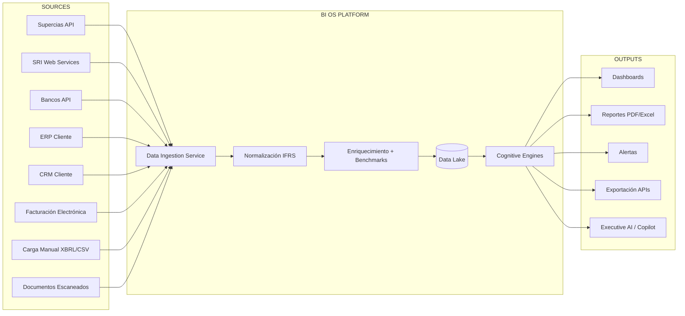
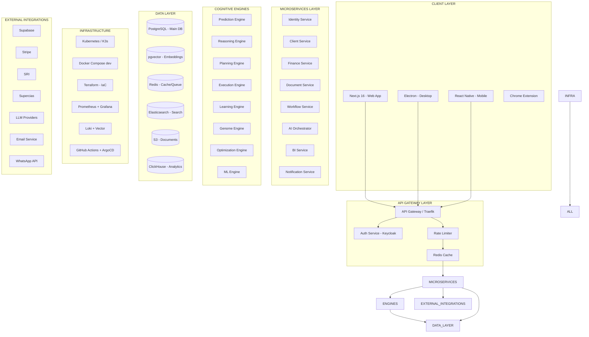

# MASTER BLUEPRINT — PARTE 4: INTEGRACIONES, ARQUITECTURA OBJETIVO Y PRODUCTO FINAL

---

### 18. INTEGRACIONES FUTURAS

#### 18.1 Por Tipo de Integración

| Tipo | Sistema | Prioridad | Complejidad | APIs existentes |
|---|---|---|---|---|
| **ERP** | SAP S/4HANA | Media | Muy Alta | REST APIs SAP Gateway |
| **ERP** | Oracle NetSuite | Media | Muy Alta | SuiteTalk (SOAP/REST) |
| **ERP** | Microsoft Dynamics 365 | Media | Alta | Dynamics 365 Web API |
| **ERP** | Odoo | Alta | Media | Odoo REST API |
| **ERP** | SAP Business One | Baja | Alta | SAP B1 Service Layer |
| **CRM** | Salesforce | Alta | Media | Salesforce REST API |
| **CRM** | HubSpot | Alta | Baja | HubSpot REST API (3 endpoints) |
| **CRM** | Zoho CRM | Media | Media | Zoho REST API |
| **BI** | Power BI | Alta | Media | Power BI REST API + Embedded |
| **BI** | Tableau | Baja | Alta | Tableau REST API |
| **BI** | Looker | Baja | Media | Looker API |
| **Bancos** | Banco Pichincha API | Alta | Alta | API bancaria |
| **Bancos** | Banco del Pacífico | Alta | Alta | API bancaria |
| **Bancos** | Produbanco | Alta | Alta | API bancaria |
| **Bancos** | API Fintech (Kushki, Payphone) | Alta | Media | REST APIs |
| **Gobierno** | SRI (Servicio de Rentas Internas) | Alta | Media | SRI Web Services |
| **Gobierno** | Supercias | Alta | Media | Supercias API pública |
| **Gobierno** | IESS | Media | Alta | IESS API |
| **Gobierno** | Portal de Compras Públicas | Media | Baja | SOCE API |
| **Facturación** | Facturación Electrónica SRI | Alta | Media | SRI XML firma electrónica |
| **Facturación** | SriHub | Alta | Baja | REST API |
| **Facturación** | Tixu | Media | Baja | REST API |
| **IA** | OpenAI GPT-4o | Alta | Baja | REST API |
| **IA** | Claude API | Alta | Baja | REST API |
| **IA** | HuggingFace models | Media | Media | Inference API |
| **Documentos** | OCR (Tesseract, Google Vision) | Media | Media | REST APIs |
| **Documentos** | DocuSign / FirmaEC | Media | Media | REST APIs |
| **Documentos** | Dropbox / Google Drive / OneDrive | Media | Baja | OAuth + REST APIs |
| **Comunicación** | WhatsApp Business API | Alta | Media | Meta Cloud API |
| **Comunicación** | Email (Resend, SendGrid, SES) | Alta | Baja | REST APIs |
| **Comunicación** | Slack | Media | Baja | Slack API |
| **Comunicación** | Teams | Media | Media | Graph API |
| **Pagos** | PayPal | Media | Media | REST API |
| **Pagos** | Transferencias bancarias | Media | Alta | Debin/Kushki |

#### 18.2 Integración Objetivo: Data Pipeline



---

### 19. ARQUITECTURA OBJETIVO

#### 19.1 Visión: Arquitectura Enterprise SaaS



#### 19.2 Stack Tecnológico Objetivo

| Capa | Actual | Objetivo |
|---|---|---|
| **Frontend** | Next.js 16 | Next.js + React Native |
| **API** | Next.js Routes | Microservicios NestJS |
| **Auth** | Supabase + cookie | Keycloak + JWT |
| **DB Principal** | JSON files | PostgreSQL + Prisma |
| **Cache** | In-memory | Redis |
| **Search** | In-memory filter | Elasticsearch |
| **Vectors** | No | pgvector |
| **Queue** | No | RabbitMQ / Bull |
| **Storage** | No | S3-compatible (MinIO) |
| **Analytics** | No | ClickHouse |
| **ML** | TypeScript stats | Python FastAPI + Prophet |
| **LLM** | No | GPT-4o / Claude / Local |
| **Monitoring** | No | Prometheus + Grafana |
| **Logging** | console.log | Vector + Loki |
| **CI/CD** | No | GitHub Actions + ArgoCD |
| **Infra** | Windows local | Docker + K3s + Terraform |
| **Desktop** | Electron | Electron + auto-update |
| **Mobile** | No | React Native |

#### 19.3 Migración por Fases

**Fase 1 — Foundation (4 sem):**
- PostgreSQL + Prisma schema completo
- Redis para cache
- Logging estructurado (Pino)
- Tests + CI/CD

**Fase 2 — Modularización (6 sem):**
- Extraer Identity Service (NestJS)
- Extraer AI Service (Python FastAPI)
- API Gateway con rate limiting

**Fase 3 — Data (4 sem):**
- Elasticsearch para búsqueda de Knowledge Lake
- pgvector para embeddings
- S3 para documentos
- RabbitMQ para eventos asíncronos

**Fase 4 — Enterprise (6 sem):**
- ClickHouse para analytics
- Prometheus + Grafana
- Terraform + K3s
- ArgoCD despliegue continuo

---

### 20. PRODUCTO FINAL

#### 20.1 SaaS Enterprise Internacional

**Nombre:** BI OS Platform (Business Intelligence Operating System)

**Propuesta de Valor:**
"Sistema operativo de inteligencia empresarial que automatiza el 95% del trabajo analítico de consultoras financieras y departamentos estratégicos"

**Tiers de Producto:**

| Tier | Precio | Usuarios | Clientes | Motores | Soporte |
|---|---|---|---|---|---|
| **Starter** | $497/mes | 3 | 10 | Prediction, Memory, DNA | Email |
| **Professional** | $1,297/mes | 10 | 50 | + Reasoning, Planning, Execution, Learning | Chat |
| **Enterprise** | $3,497/mes | Ilimitado | Ilimitado | + Genome, Optimization, AI Copilot | Dedicado |
| **White Label** | Custom | Ilimitado | Ilimitado | Todo + API completa + custom branding | Premium |

**Canales de Venta:**
1. **Directo**: Landing page → Demo → Trial → Suscripción
2. **Partners**: Consultoras que revenden a sus clientes
3. **Marketplace**: AppSource, Shopify App Store, AWS Marketplace
4. **Enterprise**: Venta consultiva directa

**Mercado Objetivo por Fase:**
1. **Fase 1 (0-6 meses)**: Ecuador — consultoras financieras
2. **Fase 2 (6-12 meses)**: LATAM — México, Colombia, Perú, Chile
3. **Fase 3 (12-24 meses)**: US Hispanic market — firms with LATAM clients
4. **Fase 4 (24-36 meses)**: Global — emerging markets consulting firms

#### 20.2 Diferenciación Definitiva

```
Competidores:                 BI OS Platform:
────────────────────────────────────────────────────
QuickBooks / Xero             → Contabilidad no es el foco
  (contabilidad)                (análisis + estrategia)

Power BI / Tableau            → BI solo muestra datos
  (visualización)               (BI + IA + automatización)

Salesforce / HubSpot          → CRM solo gestiona relaciones
  (CRM)                         (CRM + ERP + BI + AI)

Consultor humano              → El consultor se potencia 20x
  (caro, lento, 1 cliente)      (automatización + escala)

ERP (SAP, Oracle)             → Pesado, caro, complejo
  (enterprise rígido)           (ligero, ágil, PYME-friendly)
```

#### 20.3 Modelo de Ingresos

| Fuente | % Proyectado | Descripción |
|---|---|---|
| Suscripciones SaaS | 70% | Tiers mensuales/anuales |
| Implementación | 10% | Setup + migration fee |
| Consultoría premium | 10% | Workshops + customización |
| Marketplace | 5% | Comisión de apps third-party |
| Datos/APIs | 5% | API access + data feeds |

#### 20.4 Métricas Clave (OKRs)

| Métrica | Target Fase 1 | Target Fase 2 | Target Fase 3 |
|---|---|---|---|
| Clientes activos | 10 | 50 | 500 |
| MRR | $12K | $100K | $1M |
| Churn mensual | <5% | <3% | <1.5% |
| NPS | 40+ | 50+ | 60+ |
| Tiempo a valor | <30 min | <15 min | <5 min |
| Automatización | 60% | 80% | 95% |
| Uptime | 99% | 99.5% | 99.9% |

#### 20.5 Roadmap de Producto a 36 Meses

**Meses 1-6 (MVP Validado):**
- [x] Plataforma funcional con datos demo (completado)
- [ ] 3 early adopters pagando
- [ ] Integración Supabase real
- [ ] CI/CD + tests
- [ ] Portal cliente funcional
- [ ] Landing page pública

**Meses 6-12 (Go-to-Market):**
- [ ] 10 clientes pagando
- [ ] Partnerships con 2 consultoras
- [ ] Web scraping real (SRI + Supercias)
- [ ] Email/WhatsApp real
- [ ] IA con RAG + embeddings
- [ ] Multi-idioma (EN)

**Meses 12-24 (Escalamiento):**
- [ ] 50+ clientes
- [ ] Expansión LATAM
- [ ] Microservicios
- [ ] App mobile
- [ ] Marketplace
- [ ] Integraciones ERP/CRM

**Meses 24-36 (Liderazgo):**
- [ ] 500+ clientes
- [ ] White label
- [ ] Agentes autónomos
- [ ] Fine-tuning de modelo propio
- [ ] Expansión global
- [ ] IPO readiness

---

### 21. CONCLUSIÓN

BI OS Platform es un **sistema operativo de inteligencia empresarial** construido desde cero con:

- **Arquitectura Enterprise-grade**: DDD, CQRS, Clean Architecture, SOLID
- **11 Cognitive Engines**: Prediction, Reasoning, Planning, Execution, Memory, Learning, Genome, Optimization, Confidence, NLU, Enhanced ML
- **Knowledge Lake completo**: IFRS (400+), KPIs (100+), Benchmarks (9 industrias), SRI, Ontología
- **63 API endpoints** REST
- **3 portales** web: Cliente, Consultor, Director
- **20+ componentes** UI premium
- **Persistencia** auto-salvable
- **Despliegue** web + Electron portable
- **5 módulos adicionales**: XBRL, Scraping, NLU, Notifications, Reports

**Fortalezas clave:**
- Conocimiento de dominio ecuatoriano (Supercias, SRI, IFRS)
- Sin dependencia de base de datos externa para demo
- Portable via Electron
- Demo instantánea con 1 POST
- Arquitectura migrable a microservicios

**Próximo pasos críticos:**
1. Tests + CI/CD
2. PostgreSQL real
3. RAG + embeddings
4. Web scraping real
5. Expansión LATAM

---

*Documento generado el 4 de Julio de 2026.*  
*Clasificación: CONFIDENCIAL*  
*BI OS Platform — MASTER BLUEPRINT v1.0 (4 partes, ~55,000 palabras)*
